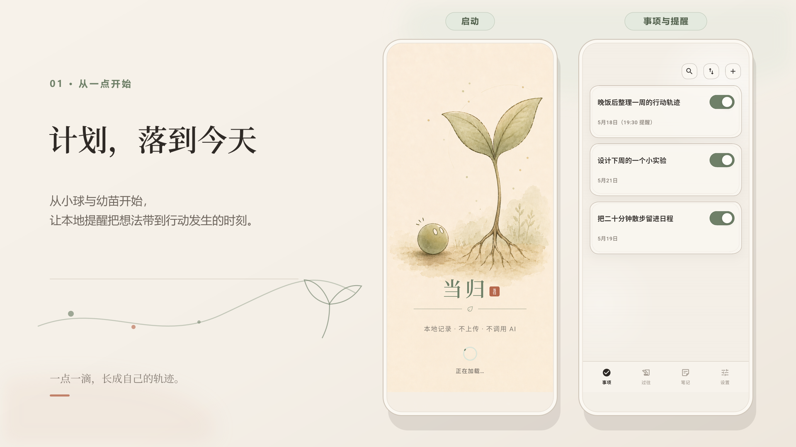
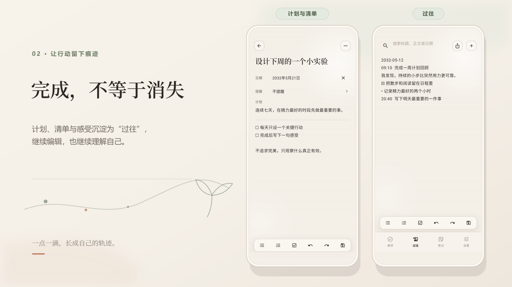
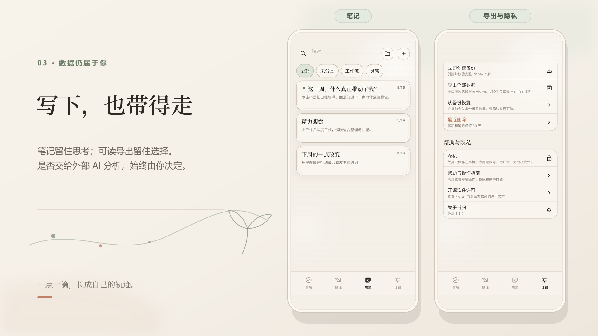

  

<h1 align="center">当归</h1>

  <strong>一点一滴，长成自己的轨迹。</strong> 
  把计划、提醒、行动、过往与笔记连成一条安静的本地工作流。

  <strong>简体中文</strong> ·
  <a href="docs/readme/README.en.md">English</a> ·
  <a href="docs/readme/README.ja.md">日本語</a> ·
  <a href="docs/readme/README.ru.md">Русский</a>

  
  
  
  

  <a href="https://danggui.hujizhou35.workers.dev/zh-CN"><strong>官方网站</strong></a> ·
  <a href="https://danggui.hujizhou35.workers.dev/zh-CN/download">获取应用</a> ·
  <a href="#产品预览">产品预览</a> ·
  <a href="#数据与隐私">数据与隐私</a> ·
  <a href="#参与项目">参与项目</a>

## 不只是列出要做什么

有些工具只关心还没发生的事，有些工具只保存已经发生的事。当归把两端接在一起：写下计划，在合适的时刻收到本地提醒，完成后留下可回看的过往，再用笔记继续思考。

计划不会在勾选后消失，记录也不必永远沉睡。日复一日的小事会逐渐成为一份只属于你的、能够阅读和迁移的生活材料。

| 计划 | 行动 | 回望 | 理解自己 |
| --- | --- | --- | --- |
| 用日期、清单与提醒安排下一步 | 在事项里推进、完成与复盘 | 把完成记录汇入可编辑的“过往” | 导出 Markdown + JSON，由你决定如何归档或分析 |

> 当归不内置 AI，也不会把数据自动上传给任何 AI 服务。应用只负责在本地整理并导出可读数据；是否把导出文件交给外部 AI、使用哪个工具、分析什么，始终由你决定。

## 产品预览

  

从小球与幼苗开始，把想法变成今天可以行动的一步。

  

完成不是清空：行动会沉淀为可以继续编辑的过往。

  

笔记留下思考，可读导出让数据真正归你。

界面采用暖纸色、鼠尾草绿与陶土红，以克制的动效和留白减少记录压力。截图来自 v1.1.2 的实际应用界面，不使用设计稿代替产品。

## 一条完整的个人工作流

- **事项与提醒**：日期、计划、清单和单次本地提醒；提醒时间直接显示在卡片上。
- **完成与过往**：完成事项时进行回顾，并将记录汇入一篇持续生长、可以自由编辑的“过往”。
- **笔记与行动互转**：用文件夹、置顶、列表和勾选项整理笔记，也可以把内容转成事项。
- **数据可带走**：生成包含 Markdown 与 JSON 的可读 ZIP，便于长期归档、迁移或交给你选择的外部工具分析；完整恢复则使用可选加密的 `.dgbak` 备份。
- **离线也完整**：应用内置帮助，界面支持简体中文、English、日本語与 Русский，可跟随系统或手动切换。

## 数据与隐私

当归的隐私不是一句口号，而是可以检查的产品边界：

- 不需要账号，也不依赖业务服务器运行。
- 不集成广告、分析、崩溃遥测、Firebase、AI 或用户追踪 SDK。
- Android 正式清单不声明 `INTERNET` 权限。
- 内容保存在应用沙箱和你主动选择的本地备份位置；应用不会自动上传到 GitHub 或其他服务。
- 可读导出只在本地生成。它刻意保持为未加密 ZIP，便于阅读与迁移；敏感文件应妥善保管，需要加密存档时请使用 `.dgbak` 备份。

格式细节见[可读导出规范](docs/portable-export-format.md)，平台边界与验证结果见[隐私平台审计](docs/qa/privacy-platform-audit.md)。

## 下载

当前获取方式、公开版本状态和 iPhone 版本进度以[官方网站下载页](https://danggui.hujizhou35.workers.dev/zh-CN/download)为准。下面保留当前 Release、校验值、源码构建和版本信息，便于核对与审计。

| 平台 | 推荐入口 | 当前交付 |
| --- | --- | --- |
| Android 7.0+ | [v1.1.4 公开预发布](https://github.com/hujizhou35-cmd/danggui-app/releases/tag/v1.1.4) | 正式签名的通用 APK；多数用户下载 `danggui-android-universal-release.apk` |
| iOS | [源码构建说明](docs/architecture/ios-source-build.md) | 完整 Xcode 源码与无签名构建证据；不提供 IPA 或 TestFlight |

v1.1.4 仍标记为 **Pre-release**：Android 自动化门禁和 iOS 无签名构建通过后才会发布，但不同厂商 Android 实体机及 iPhone 的锁屏、声音、触感和隔夜投递仍需持续验证。安装前建议备份已有数据，并使用 Release 中的 `SHA256SUMS` 核对文件。分架构 APK、AAB、iOS 构建证据、签名证书与校验记录统一收在 `danggui-developer-assets-v1.1.4.zip`；完整边界见[交付说明](docs/architecture/platform-delivery.md)与 [v1.1.4 检查表](docs/release/v1.1.4-release-checklist.md)。

## 版本演进

| 版本 | 这一点滴带来了什么 |
| --- | --- |
| [v1.0.0](https://github.com/hujizhou35-cmd/danggui-app/releases/tag/v1.0.0) | 建立事项、提醒、过往、笔记、备份与可读导出的完整本地基础。 |
| [v1.1.0](https://github.com/hujizhou35-cmd/danggui-app/releases/tag/v1.1.0) | 加固编辑器与提醒生命周期，并恢复小球与幼苗的完整启动体验。 |
| [v1.1.2](https://github.com/hujizhou35-cmd/danggui-app/releases/tag/v1.1.2) | 支持每分钟选择提醒，增加明确保存反馈，压紧过往排版，并消除重复启动画面。 |
| [v1.1.3](https://github.com/hujizhou35-cmd/danggui-app/releases/tag/v1.1.3) | 将有声提醒升级为原生闹钟，增加应用内权限引导、长页快速滚动条，并修复长期不消失的操作提示。 |
| [v1.1.4](https://github.com/hujizhou35-cmd/danggui-app/releases/tag/v1.1.4) | 加固 Android 直达响铃链路、双端修订事务与 15 分钟过期语义，并增加可审计的闹钟快照与诊断。 |

完整变化见 [CHANGELOG](CHANGELOG.md)。

## 参与项目

当归欢迎不同形式的参与：

- 在 [Issues](https://github.com/hujizhou35-cmd/danggui-app/issues) 报告可复现问题或提出功能建议。
- 在 [Discussions](https://github.com/hujizhou35-cmd/danggui-app/discussions) 分享工作流、提问或讨论想法。
- Fork 仓库，在自己的分支完成修改，再提交 Pull Request；陌生贡献者不会获得主仓库的直接写权限。
- 帮助校对四语文案、无障碍体验和不同 Android 设备上的提醒行为。

开始前请阅读[贡献指南](CONTRIBUTING.md)与[安全说明](SECURITY.md)。Issue、Discussion 和 PR 中请勿上传真实事项、笔记、数据库、备份、密码、证书或个人信息。

## 许可证与品牌

源代码采用 [Apache License 2.0](LICENSE)。第三方依赖与字体遵循各自许可证，见[第三方许可说明](THIRD_PARTY_NOTICES.md)。“当归”名称、应用图标、启动插画及其他品牌视觉不包含在 Apache-2.0 授权中，相关权利保留；分发修改版时必须移除或替换这些品牌资产，详见[品牌与商标说明](TRADEMARKS.md)。
