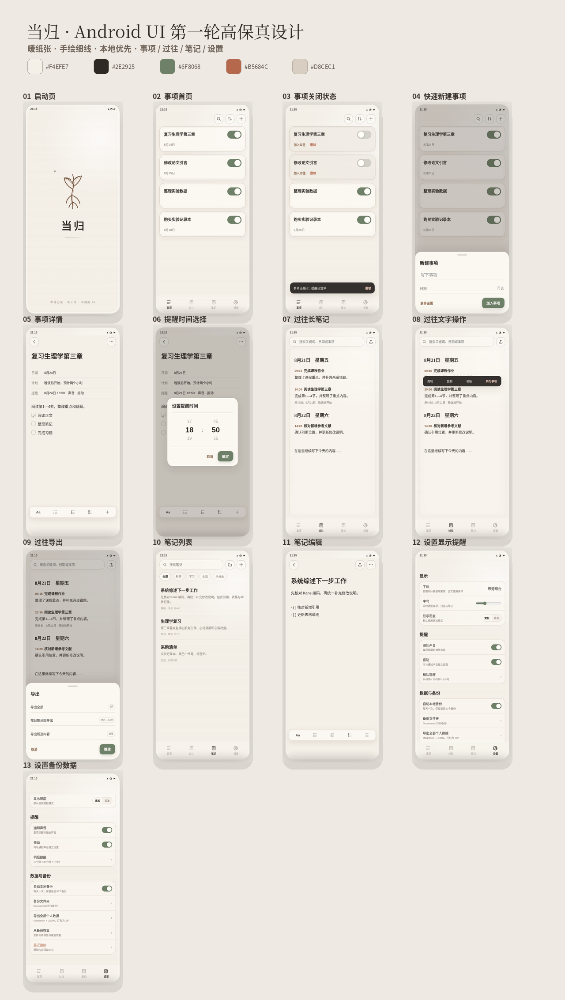

  

<h1 align="center">当归</h1>

<strong>Local records · No uploads · No AI</strong>

  <a href="../../README.md">简体中文</a> ·
  <strong>English</strong> ·
  <a href="README.ja.md">日本語</a> ·
  <a href="README.ru.md">Русский</a>

> [!IMPORTANT]
> Danggui is in v1.0.0 release preparation. Android packages are uploaded only after signing, permission, checksum, and release gates pass. If the Releases page does not yet contain v1.0.0, the current delivery is source code; a CI debug package is not an official release. This release provides complete iOS source and unsigned build evidence, but no IPA or TestFlight distribution.

## A quiet, local-first place for plans and memories

Danggui combines tasks, a continuously growing history document, and independent notes without accounts, uploads, AI, analytics, ads, or profiling.

- Tasks with dates, plans, checklists, and one local reminder shown directly on each card.
- Completed tasks can be appended to an editable long-form history.
- Notes with one-level folders, pinning, lists, checkboxes, and task conversion.
- Transactional SQLite storage, migrations, integrity checks, optionally encrypted `.dgbak` backups, merge/replace restore, and readable Markdown + JSON exports.
- Detailed offline Help plus Simplified Chinese, English, Japanese, and Russian UI, with system-following and manual language selection.

## Preview

  

## Distribution

| Platform | Delivery |
| --- | --- |
| Android | Signed universal and split APKs plus AAB, uploaded to [GitHub Releases](https://github.com/hujizhou35-cmd/danggui-app/releases) after every release gate passes |
| iOS | Complete source, Xcode project, and unsigned `Runner.app` build evidence; no IPA or TestFlight distribution in v1.0.0 |

Official Android releases include `SHA256SUMS` and the signing certificate SHA-256 fingerprint. Most users should choose the APK whose filename contains `universal-release.apk`; split APKs are for users who know their device ABI, and the AAB is for store or managed distribution. See the [platform delivery guide](../architecture/platform-delivery.md) and the [v1.0.0 release checklist](../release/v1.0.0-release-checklist.md).

## Privacy and license

The app does not require an account or runtime backend. It contains no advertising, analytics, Firebase, AI, or user-tracking SDK. User content stays in the app sandbox and user-selected local backups; Android packages do not request `INTERNET`. Source code is licensed under [Apache-2.0](../../LICENSE). Third-party software and the bundled font retain their own licenses; see [THIRD_PARTY_NOTICES.md](../../THIRD_PARTY_NOTICES.md). The Danggui name, icon, launch artwork, and other brand assets are not covered by Apache-2.0 and remain reserved; see [TRADEMARKS.md](../../TRADEMARKS.md).
