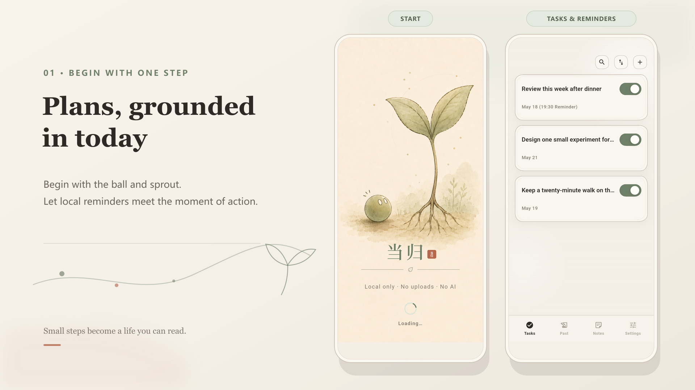
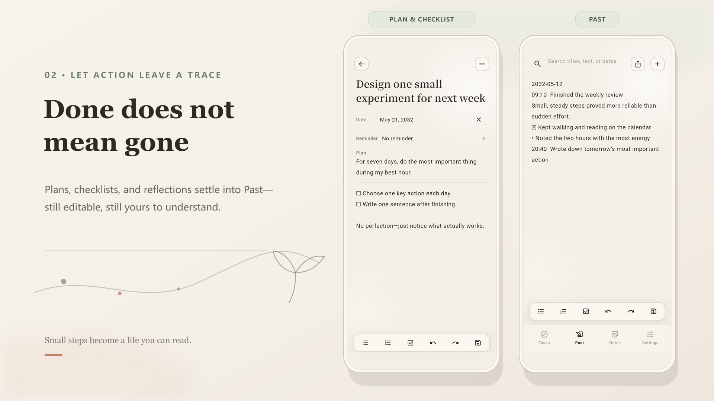
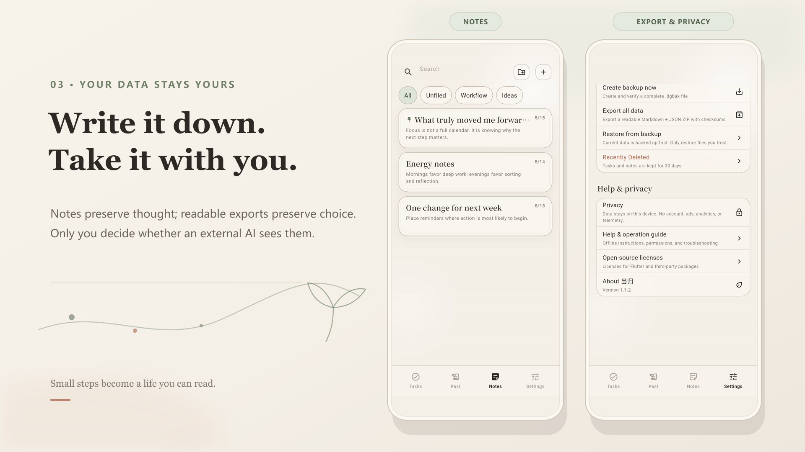

  

<h1 align="center">当归</h1>

  <strong>Шаг за шагом — к истории, которую можно прочитать.</strong> 
  Спокойный локальный процесс, объединяющий планы, напоминания, действия, прошлое и заметки.

  <a href="../../README.md">简体中文</a> ·
  <a href="README.en.md">English</a> ·
  <a href="README.ja.md">日本語</a> ·
  <strong>Русский</strong>

  
  
  
  

  <a href="https://github.com/hujizhou35-cmd/danggui-app/releases/tag/v1.1.3"><strong>Скачать для Android</strong></a> ·
  <a href="#предварительный-просмотр">Предварительный просмотр</a> ·
  <a href="#данные-и-конфиденциальность">Конфиденциальность</a> ·
  <a href="#участие-в-проекте">Участие</a>

## Больше, чем список дел

Одни инструменты смотрят только на то, что ещё не произошло. Другие сохраняют лишь то, что уже случилось. Danggui соединяет эти две стороны: составьте план, получите локальное напоминание в нужный момент, сохраните след выполненного дела и продолжите размышление в заметках.

План не исчезает после отметки о выполнении, а записи не обязаны вечно спать в дневнике. Обычные ежедневные шаги постепенно становятся материалом вашей жизни — его можно прочитать, перенести и осмыслить на своих условиях.

| План | Действие | Взгляд назад | Понимание себя |
| --- | --- | --- | --- |
| Наметьте следующий шаг с датой, списком и напоминанием | Выполните задачу и подведите итог | Добавьте результат в редактируемое «Прошлое» | Экспортируйте Markdown + JSON и сами выберите архив или способ анализа |

> В Danggui нет встроенного ИИ, и приложение никогда не отправляет данные сервисам ИИ автоматически. Оно лишь упорядочивает записи локально и создаёт читаемый экспорт. Передавать ли его внешнему ИИ, какой инструмент выбрать и что анализировать — всегда решает пользователь.

## Предварительный просмотр

  

Начните с шара и ростка, затем превратите мысль в шаг, который можно сделать сегодня.

  

Завершение — не удаление: действия складываются в редактируемое «Прошлое».

  

Заметки сохраняют мысли, а читаемый экспорт оставляет данные под вашим контролем.

Тёплый бумажный фон, шалфейный зелёный и терракотовый красный сочетаются со сдержанной анимацией и свободным пространством, чтобы вести записи было легче. Это снимки реального приложения v1.1.2, а не макеты.

## Единый личный процесс

- **Задачи и напоминания:** даты, планы, списки и одно локальное напоминание, время которого видно на карточке задачи.
- **Завершение и «Прошлое»:** подведите итог при завершении, затем добавьте запись в единый растущий и свободно редактируемый документ.
- **Заметки, переходящие в действие:** папки, закрепление, списки и флажки помогают навести порядок; содержимое можно превратить в задачу.
- **Данные, которые можно забрать:** создайте читаемый ZIP с Markdown + JSON для долговременного архива, переноса или анализа во внешнем инструменте по вашему выбору. Для полного восстановления используйте резервную копию `.dgbak` с необязательным шифрованием.
- **Полноценная работа без сети:** встроенная справка и интерфейс на упрощённом китайском, английском, японском и русском языках с системным или ручным выбором.

## Данные и конфиденциальность

Конфиденциальность Danggui — это проверяемые границы продукта:

- Учётная запись не нужна, для работы не требуется сервер приложения.
- Нет рекламы, аналитики, телеметрии сбоев, Firebase, ИИ и SDK для отслеживания пользователей.
- Рабочий манифест Android не запрашивает разрешение `INTERNET`.
- Содержимое остаётся в песочнице приложения и в локальных местах резервного копирования, которые вы явно выбрали. Оно не загружается на GitHub или в другие сервисы.
- Читаемый экспорт создаётся локально. Для переносимости это намеренно незашифрованный ZIP, поэтому защищайте конфиденциальные файлы; для зашифрованного хранения используйте резервную копию `.dgbak`.

Проверяемые детали описаны в [спецификации переносимого экспорта](../portable-export-format.md) и [аудите конфиденциальности платформ](../qa/privacy-platform-audit.md).

## Скачать

| Платформа | Рекомендуемый источник | Текущая поставка |
| --- | --- | --- |
| Android 7.0+ | [Публичная предварительная версия v1.1.3](https://github.com/hujizhou35-cmd/danggui-app/releases/tag/v1.1.3) | Универсальный APK с официальной подписью; большинству нужен `danggui-android-universal-release.apk` |
| iOS | [Инструкция по сборке из исходников](../architecture/ios-source-build.md) | Полный проект Xcode и подтверждение сборки без подписи; без IPA и TestFlight |

v1.1.3 остаётся **Pre-release**. Автоматические приёмочные проверки пройдены, но нативные будильники, экран блокировки, звук, вибрация и обновление поверх установленной версии ещё проверяются на физических Android-устройствах разных производителей. Перед установкой сохраните резервную копию и сверьте файл с `SHA256SUMS` из Release. APK для отдельных ABI, AAB, подтверждения сборки iOS, сертификат подписи и записи проверки собраны в `danggui-developer-assets-v1.1.3.zip`; большинству пользователей он не нужен. Полные границы поставки описаны в [руководстве](../architecture/platform-delivery.md) и [списке проверок v1.1.3](../release/v1.1.3-release-checklist.md).

## История версий

| Версия | Что добавил этот шаг |
| --- | --- |
| [v1.0.0](https://github.com/hujizhou35-cmd/danggui-app/releases/tag/v1.0.0) | Заложил локальную основу задач, напоминаний, «Прошлого», заметок, резервных копий и читаемого экспорта. |
| [v1.1.0](https://github.com/hujizhou35-cmd/danggui-app/releases/tag/v1.1.0) | Повысил надёжность редактора и жизненного цикла напоминаний, вернул полный стартовый экран с шаром и ростком. |
| [v1.1.2](https://github.com/hujizhou35-cmd/danggui-app/releases/tag/v1.1.2) | Добавил выбор напоминаний с точностью до минуты и явную обратную связь при сохранении, уплотнил «Прошлое» и убрал дублирование стартовой композиции. |
| [v1.1.3](https://github.com/hujizhou35-cmd/danggui-app/releases/tag/v1.1.3) | Перевёл звуковые напоминания на нативные будильники, добавил подсказки по разрешениям и быструю прокрутку длинных страниц, исправил не исчезавшие сообщения. |

Полный список изменений — в [CHANGELOG](../../CHANGELOG.md).

## Участие в проекте

Помочь Danggui можно разными способами:

- Сообщить о воспроизводимой ошибке или предложить конкретную функцию в [Issues](https://github.com/hujizhou35-cmd/danggui-app/issues).
- Поделиться своим процессом, задать вопрос или обсудить идею в [Discussions](https://github.com/hujizhou35-cmd/danggui-app/discussions).
- Сделать Fork, внести изменения в собственной ветке и открыть Pull Request. Внешние участники не получают прямой доступ на запись в основной репозиторий.
- Помочь с переводами, доступностью и проверкой напоминаний на разных Android-устройствах.

Сначала прочитайте [руководство участника](../../CONTRIBUTING.md) и [политику безопасности](../../SECURITY.md). Никогда не добавляйте в Issue, Discussion или Pull Request настоящие задачи, заметки, базы данных, резервные копии, пароли, сертификаты или личную информацию.

## Лицензия и бренд

Исходный код распространяется по [Apache License 2.0](../../LICENSE). Стороннее ПО и встроенный шрифт сохраняют собственные лицензии; см. [THIRD_PARTY_NOTICES.md](../../THIRD_PARTY_NOTICES.md). Название Danggui, значок, стартовая иллюстрация и другие элементы бренда не входят в Apache-2.0, и права на них сохранены. При распространении изменённой сборки их необходимо удалить или заменить согласно [TRADEMARKS.md](../../TRADEMARKS.md).
